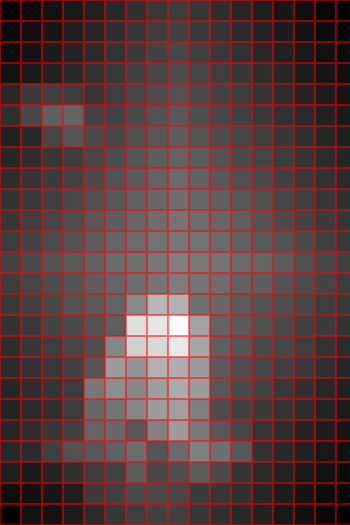

# Autofocus

Automatic image focal point detection.


## Overview

Autofocus is an image analysis library which attempts to determine where the focal point of an image is.


## Installation

```
composer require freshleafmedia/autofocus
```


## Usage

```php
use FreshleafMedia\Autofocus\FocalPointDetector;

$focalPointDetector = new FocalPointDetector();

$point = $focalPointDetector->getPoint(new Imagick('/path/to/image'));

$point->x; // 283
$point->y; // 157
```


## How it works

The algorithm works by picking the busiest area of the image:

1. Detect edges
2. Apply a vignette. This pushes the focus towards the centre
3. Split the image into segments
4. Calculate the average brightness within each segment
5. Pick the segment with the highest brightness





## Options

The `FocalPointDetector` constructor takes a number of options:

```php
new FocalPointDetector(
    segmentSize: 20, // The size of the Segments in pixels
);
```


## Debugging

You can get access to the processed image to see how the focus was determined:

```php
use FreshleafMedia\Autofocus\FocalPointDetector;

$focalPointDetector = new FocalPointDetector();

$focalPointDetector
    ->debug(new Imagick('/path/to/image'))
    ->drawHeatMap()
    ->drawGrid()
    ->getRawImage()
    ->writeImage(__DIR__ . '/debug.jpg');
```


## Tests

Unit tests can be run via `composer test`


## Credits

This library is essentially a PHP port of https://github.com/sylvainjule/kirby-autofocus.


## License

See [LICENSE](LICENSE)
